# Code quiz

This project is about creating a code quiz, with a choice of themes, a set of questions, and a high score board, focussing on using the DOM methods to render section in javascript.

These links provide more information about the [DOM tree](https://www.w3schools.com/js/js_htmldom.asp) and [what it is exactly](https://www.freecodecamp.org/news/what-is-the-dom-document-object-model-meaning-in-javascript/), as well as [the different methods used to interact with it](https://developer.mozilla.org/en-US/docs/Web/API/Element).

Deployed URL: [https://am0031.github.io/code-quiz/](https://am0031.github.io/code-quiz/)

Github repository: [https://github.com/Am0031/code-quiz](https://github.com/Am0031/code-quiz)

## Technologies

For this quiz, the technologies used are:

- HTML for general page structure
- CSS for general styling of the page
- Javascript for functionality of the page,
- HTML DOM for removal/creation of elements,
- Use of local storage

## Steps followed to develop this code quiz

Below is a list of the steps in the order they were taken:

- general definition of the project : what is the format of the quiz and how should it run?
- setting up the wireframe of the project to establish a clear view of the structure of the page
- applying styling to the page to establish a consistent style across all sections of the page, and cater for responsiveness of the page (using media query)
- using javascript to add functionality :
  - move through the sections to display (remove the current section and render the new section)
  - read the user's interactions to record answers and work out score
  - interact with local storage to record score and work out high scores
- check happy path and also other situations (timer runs out, user leaves name field blank)
- once code is functional, review the code for refactoring possibilities

## General description of the project

The quiz offers a choice of coding related themes. When the user starts the quiz, the first step os for them to pick a theme, they are then presented with a few multiple choice questions relating to that theme.

The quiz has a countdown feature. The starting number for the countdown is automatically determined by the number of questions in that theme. When the user gives a wrong answer, time is taken off the remaining timer value. The final score is the remaining timer value at the end of the quiz. At the end of the quiz, the user is presented with a form where they add their name so that their score can be recorded. If the user has a score of 0, it cannot be recorded. All recorded scores are sorted and displayed on a separate page in a high scores table.

## Setting up the wireframe

The wireframe helps us to have a clear understanding of the different sections to be displayed on the page and the general layout within the sections.
The general layout will include:

- a header with links to each page
- a main section which will host the various sections to be displayed for the quiz such as: start section, theme selection, timer and quiz questions, the form to record the score and the various end messages
- a footer with links to email and github

Below is a screenshot of the general layout for the start page, for both desktop and mobile viewports:

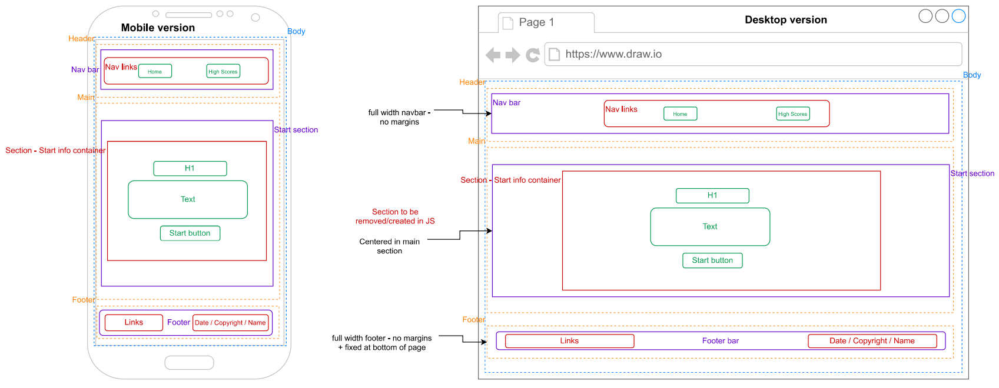

The wireframe is also available for all the sections to be rendered with javascript. See below:

<details>
<summary> Complete wireframe for all pages and sections to be rendered</summary>


</details>

## CSS styling

It's important to style the page and all the sections to be rendered before they are transfered into javascript. This process helps make sure that all elements are positioned appropriately on both viewports, and that the styling is consistent through all the sections.

To achieve this, the following was done:

- the sections to be rendered are allocated the class "wrapper" that helps apply the relevant flex properties to these containers. Furthermore, the navbar and footerbar are allocated the class "box-row" to ensure their content is displayed in a row.
- the margins, paddings and the footer's font-size are adjusted where needed for a coherent display on mobile viewports
- the header and footer links are assigned the same colour, link style and a fontawesome icon for consistent styling across the page
- the buttons, links and question answers which are to be displayed in the main section are allocated the class "btn" which gives them all the same button look
- the sections are styled to make sure that the footer remains at the bottom of the viewport and the main section occupies the available space in the viewport between the header and the footer

## Screenshots of the project

See below screenshots of the code quiz, offering a view of the screen while the user answers questions, for both mobile and desktop views.
All screen views are available, grouped per viewport and labelled as per their section name.

View on a desktop viewport:

<details>
<summary>Desktop viewport - Start section</summary>

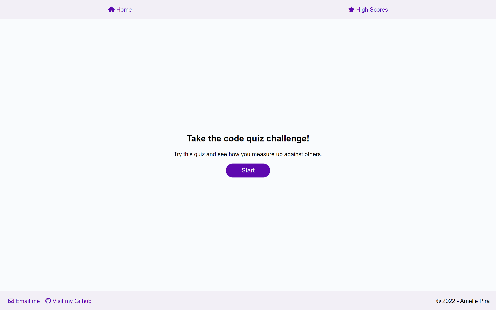

</details>

<details>
<summary>Desktop viewport - Theme section</summary>

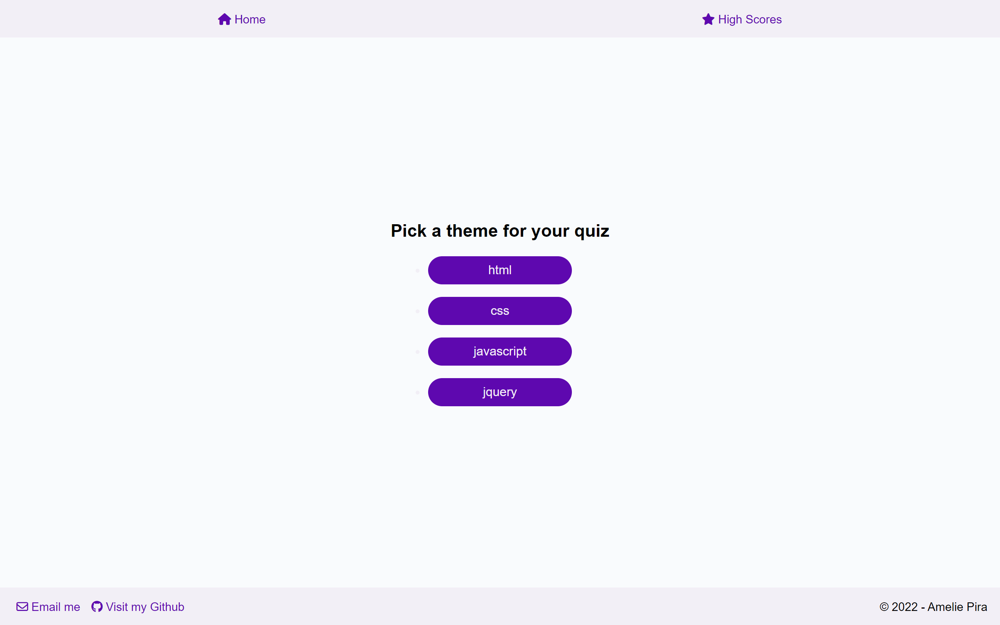

</details>

<details>
<summary>Desktop viewport - Question section</summary>

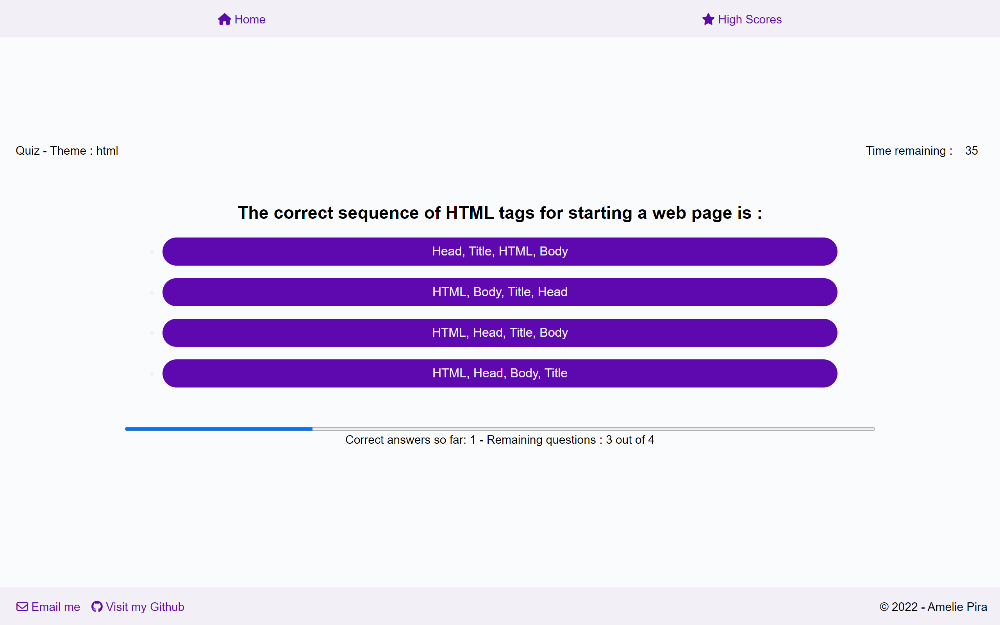

</details>

<details>
<summary>Desktop viewport - Form section</summary>

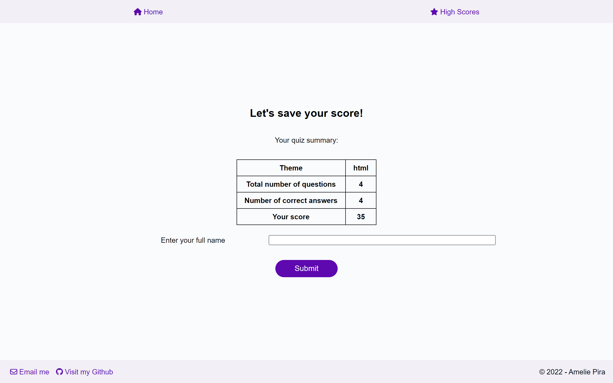

</details>

<details>
<summary>Desktop viewport - End message section</summary>

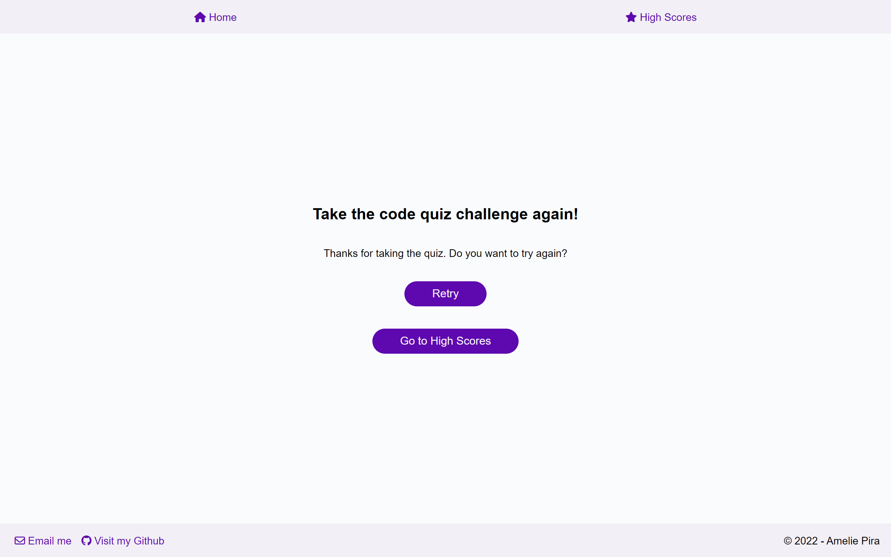

</details>

<details>
<summary>Desktop viewport - High scores section</summary>

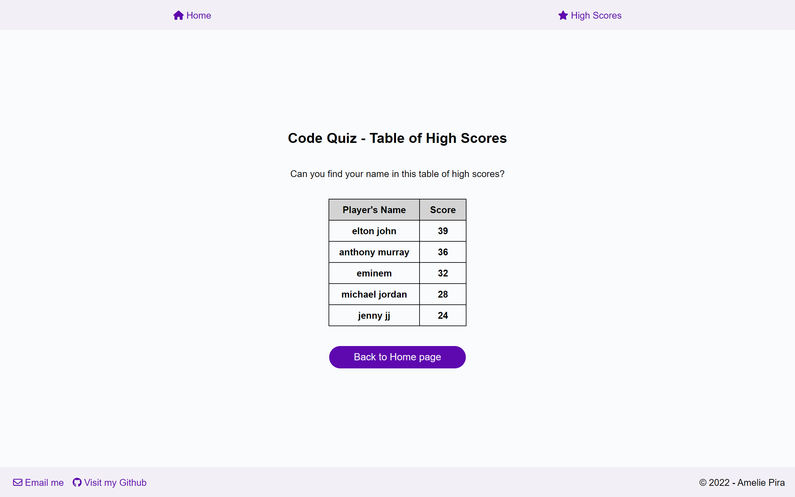

</details>

View on a mobile viewport:

<details>
<summary>Mobile viewport - Start section</summary>

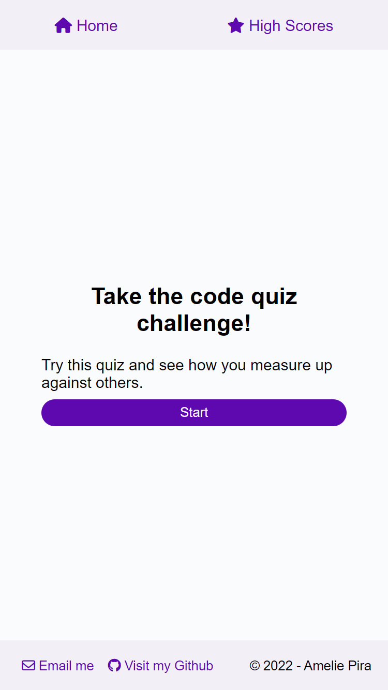

</details>

<details>
<summary>Mobile viewport - Theme section</summary>

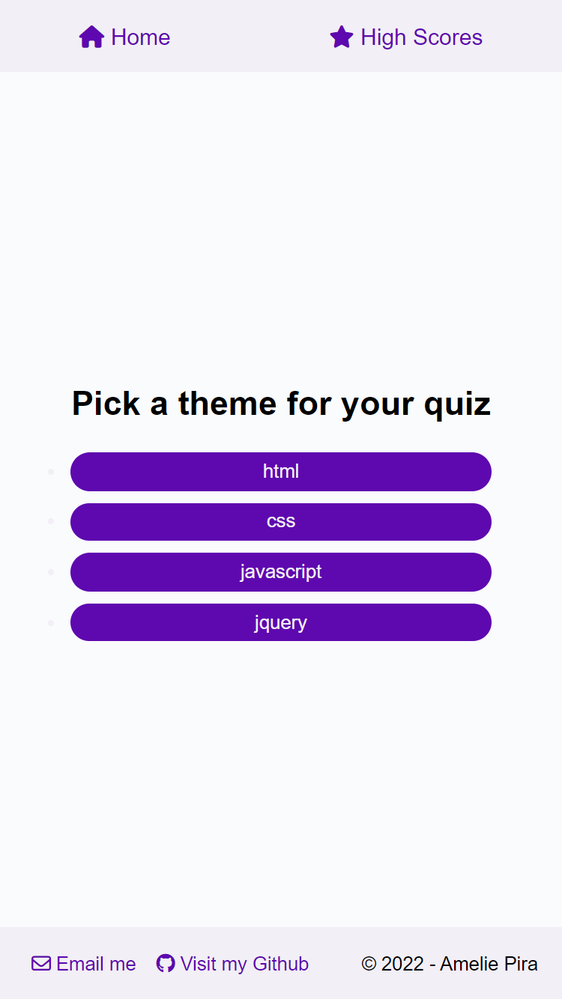

</details>

<details>
<summary>Mobile viewport - Question section</summary>

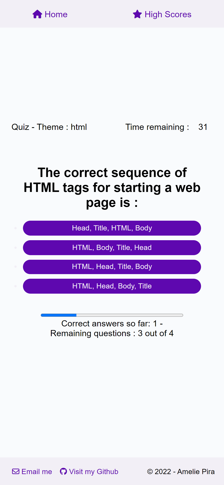

</details>

<details>
<summary>Mobile viewport - Form section</summary>

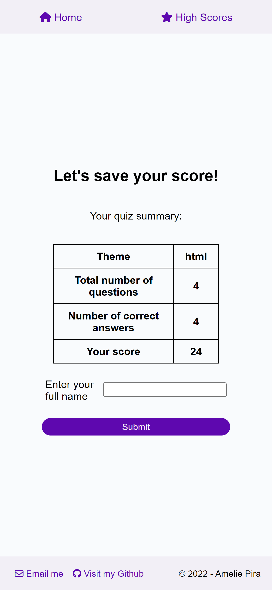

</details>

<details>
<summary>Mobile viewport - End message section</summary>

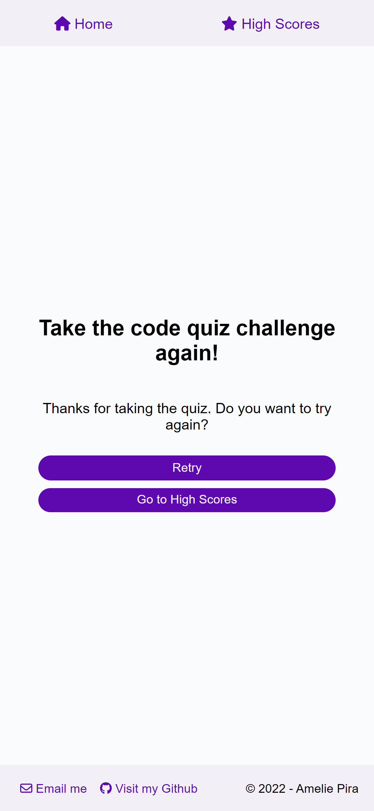

</details>

<details>
<summary>Mobile viewport - High scores section</summary>

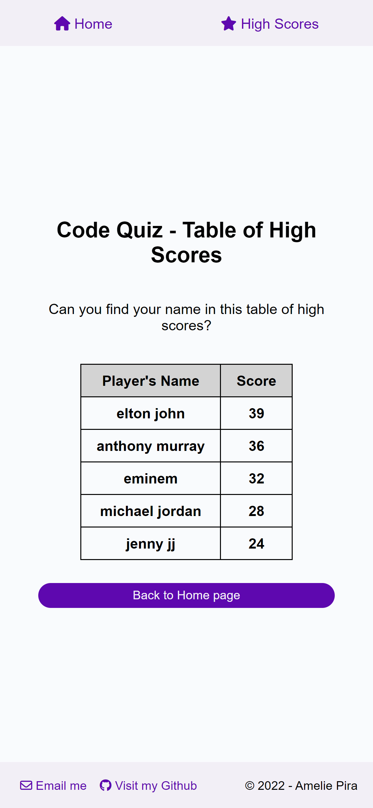

</details>

## Javascript functionalities

### Moving through the sections

The DOM methods used in order to remove the currently displayed section and create the new section are:

- `.remove()` : to remove the section from the display
- `.createElement()` : to create the element
- `.setAttribute()` : to allocate the relevant class, id, and other data-attributes
- `.textContent` : to add the relevant text to be displayed in the element
- `.append()` and `.appendChild()` : to append the created elements as per the desired structure to the main section
- `.addEventListener()` : to listen for clicks from the user and be able to direct them to the next section

See below a snippet of the javascript code used to create the theme page for illustration:

<details>
<summary>Code to render the theme section</summary>

```javascript
const renderTheme = () => {
  //remove start section
  const startSection = document.getElementById("start-section");
  startSection.remove();

  //create section
  const themeSelection = document.createElement("section");
  themeSelection.setAttribute("class", "theme-selection wrapper");
  themeSelection.setAttribute("id", "theme-selection");
  //create div
  const themeDiv = document.createElement("div");
  themeDiv.setAttribute("class", "theme-container");
  themeDiv.setAttribute("id", "theme-container");
  //create h2
  const h2 = document.createElement("h2");
  h2.setAttribute("class", "title");
  h2.textContent = "Pick a theme for your quiz";
  //create ul
  const ul = document.createElement("ul");
  ul.setAttribute("class", "list");
  //for each theme create li and append to ul
  const renderListItems = (theme) => {
    const li = document.createElement("li");
    li.setAttribute("class", "theme-item btn");
    li.setAttribute("data-text", theme);
    li.setAttribute("id", theme);
    li.textContent = theme;
    ul.appendChild(li);
  };
  themes.forEach(renderListItems);

  //append children to theme div
  themeDiv.append(h2, ul);
  //append div to section
  themeSelection.append(themeDiv);
  //append section to main
  main.append(themeSelection);

  // add event listener on theme section
  themeSelection.addEventListener("click", handleThemeClick);
};
```

</details>

### Reading the user's interactions

To be able to process the user's choices (for theme and answers), we go through two steps:

- it is important to first check that their click was made on one of the list items provided. To achieve that, we can check the target's tag name and make sure that actions are triggered only when the tag name equals "LI" (tag name for list items).
- once this is confirmed, we can then retrieve the relevant data-attribute from the selected list item and use it to run the relevant function to handle the click. See two examples below:

<details>
<summary> Code for handling theme click</summary>

```javascript
const handleThemeClick = (event) => {
  const target = event.target;
  const currentTarget = event.currentTarget;

  // act only if click is on list item
  if (target.tagName === "LI") {
    // get the answer from the user
    selectedTheme = target.getAttribute("data-text");
    // create the array containing the questions matching the selected theme
    selectedQuestions = questions.filter(
      (question) => question.theme === selectedTheme
    );
    //set the time value according to the array length - 10s per question
    timerValue = 10 * selectedQuestions.length;

    // remove the current section displayed
    currentTarget.remove();
    // render the next relevant section
    renderTimerSection();
    renderQuestion(selectedQuestions[questionIndex]);
  }
};
```

</details>

<details>
<summary> Code for handling question click</summary>

```javascript
const handleQuestionClick = (event) => {
  const currentTarget = event.currentTarget;
  const target = event.target;

  // act only if click is on list item
  if (target.tagName === "LI") {
    //get the answer from the user
    const selectedAnswer = parseInt(target.getAttribute("data-index"));

    //compare data index to correct index
    if (selectedAnswer === selectedQuestions[questionIndex].correctIndex) {
      //add 1 to the count of correct answers
      correctAnswers += 1;
    } else {
      timerValue -= 5;
    }

    //remove the current section displayed
    currentTarget.remove();
    //check where we are in list of question - if we are not at the last one
    if (questionIndex < selectedQuestions.length - 1) {
      // increase question index by 1
      questionIndex += 1;
      // render the next question
      renderQuestion(selectedQuestions[questionIndex]);
    }
    // if we are at the last question
    else {
      // save the score
      score = timerValue;
      quizComplete = true;
      // render the form section
      renderForm();
    }
  }
};
```

</details>

### Recording the score

The score is derived from the timer value at the end of the quiz. When the timer value is above 0, the score can be recorded as the user is directed to a form where they are expected to enter their name to be able in a text field and submit it.

When the user tries to submit their score without a name, they are presented with an alert that inform them that they must enter a name in the text field to be able to continue.

<details>
<summary>Screenshot of alert box when trying to submit with no name</summary>

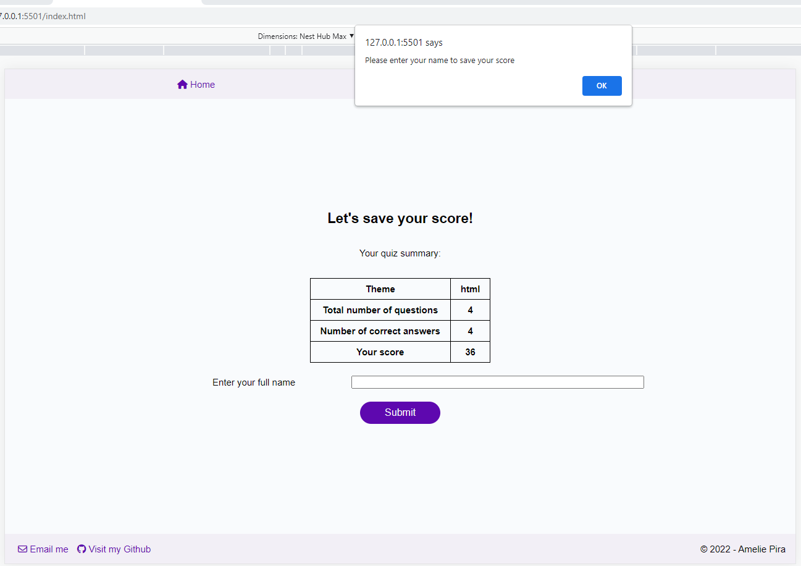

</details>

### Interacting with local storage

Recording the score is done by accessing the local storage and updating its content.
For this process, we have set up the following groups of utility functions, which are called on load of the page and on form submission:

Functions to get, set or create any score in the local storage:

```javascript
// utility functions

const getScoresFromLS = () => {
  return getFromLS(scoresLSKey);
};

const createScoresInLS = () => {
  localStorage.setItem(scoresLSKey, JSON.stringify([]));
};

const writeScoresToLS = (data) => {
  //get scores from Local storage
  const highScores = getScoresFromLS();
  // push new score object into array
  highScores.push(data);
  //write the updated array into local storage
  writeToLS(scoresLSKey, highScores);
};
```

These functions call on some additional utility functions that are designed to get from or set in the local storage any key and values passed to them:

```javascript
// utility functions
const getFromLS = (key) => {
  return JSON.parse(localStorage.getItem(key));
};

const writeToLS = (key, data) => {
  localStorage.setItem(key, JSON.stringify(data));
};
```

Should the project be expanded with additional pages or functions, it will be possible to call on these functions to interact with the local storage.

### Other scenarios

When taking the quiz, it is possible that the user may not finish the quiz within the time set by the timer value. In that case, when the timer runs out, the user is presented with a new section including a message informing the user that they run out of time and didn't score any points. They also have access to two buttons to go back tp the home page and take the quiz again, or go see the high scores table.

<details>
<summary>Screenshot of message when timer runs out</summary>

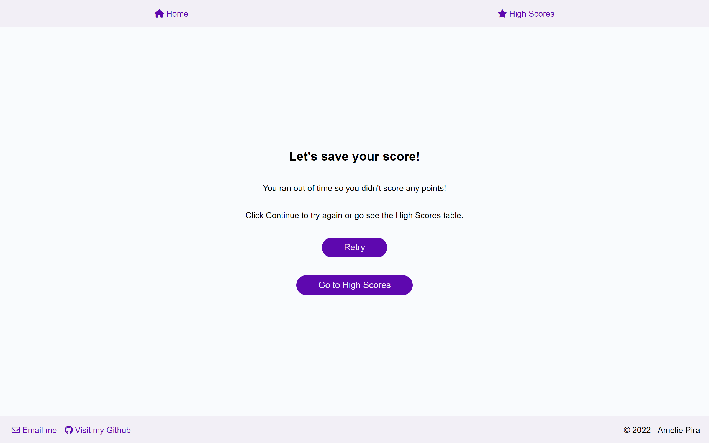

</details>

## High Scores page

The user can navigate the the high scores page via the navbar link, or at the end of the quiz with a link button in the main section.

This page presents the user either with a message when there's no scores recorded yet, or with a table of the 5 highest scores recorded in local storage.

To extract the 5 hightest scores from the date in local storage, we use the `.sort` and `.slice` methods as follow:

```javascript
const getHighScores = (highScoresFromLS) => {
  //use array.sort function
  highScoresFromLS.sort((a, b) => b.score - a.score);
  return highScoresFromLS.slice(0, 5);
};
```

The table of high scores is then rendered using the same functions as described in the above section **Moving through the sections**, and using the `.forEach` method to render the rows in the table:

```javascript
const renderRows = (highScore) => {
  const row = document.createElement("tr");
  const rowData1 = document.createElement("td");
  rowData1.innerHTML = highScore.fullName;
  const rowData2 = document.createElement("td");
  rowData2.innerHTML = highScore.score;
  row.append(rowData1, rowData2);
  table.appendChild(row);
};
topHighScores.forEach(renderRows);
```

## Possible additional features

Ways to improve the functionality of this quiz would be:

- have a calculation method that normalises the score across all themes as they may have a different number of questions. that way, they can be compared effectively in the high scores table.
- optimise the correct answer display by adding a grid section under the quiz progress bar where the answer status can be progressively displayed, with a green tick when answered correctly, and a red cross when answered wrong.
